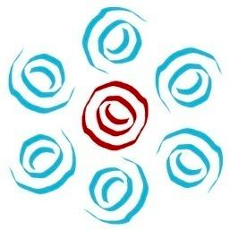

<!-- <a class="text-dark" href="">Testimonial</a>
 -->
<!-- 
 -->

<!-- 
<h3>Projects at Robolab Technologies</h3>

<h4>Underactuated Robotic Hand:</h4>
Developed a 1.2:1 scaled robotic hand that could mimic the movements of a human hand as a part of the company’s research project.

{:class="img-responsive width=176 height=71"}   

<h4>Miniature Industrial Production System:</h4>
Developed and designed an entire industrial production system including a 5+1 DOF robotic arm, and fully automated material handling system.

{:class="img-responsive width=90 height=30"}   

<h4>DrawBot:</h4>
Developed a mini drawing robot with a workspace of 50mm X 50mm X 50mm as a fulfilment towards customer requirement.

 -->

{:class="img-responsive width=176 height=71"}               
                

<b>  Greensight Agronomics, Boston, MA, USA </b>
                 
                Software Engineer in Training - Perception | Planning, October 2018 - Present
                 
                 
                <!-- <a class="text-dark" href="">Testimonial</a>
 -->

 
 

{:class="img-responsive width=176 height=71"}               
                

<b>  Robolab Technologies, Pune, MH, India </b>
                 
                Research and Development Engineer, July 2016 - June 2017
                 
                 

       

      

